tutorial version 1.2 (corresponding to AlphaTraj version 1.2.3)
# Contents
- [Installation](#installation)
   - [Enviroment](#environment)
   - [Installation](#installation-1)
- [User Guide](#user-guide)
   - [Trajectory preprocessing](#trajectory-preprocessing)
   - [Using AlphaTraj](#using-alphatraj)
   - [Running AlphaTraj (Demonstration)](#running-alphatraj-demonstration)
- [Output File Explanation](#output-file-explanation)
- [Drawing Demo](#drawing-demo)
   - [Protein surface diagram](#protein-surface-diagram)
   - [Temporal evolution plots of the groups](#temporal-evolution-plots-of-the-groups)

# Installation

## Environment

AlphaTraj is a Python script that relies on Python to run. Please make sure that Python (version > 3.5) is installed on the computer or server where you intend to run the program. After installing Python, you also need to install three Python packages: scipy, mdtraj, and tqdm.

<span style="color: #c8c8c8;">*Note: Anaconda is a popular Python environment management tool that provides a large number of Python packages. Using Anaconda to create and manage environments will be easier and simpler.*</span>

The following code demonstrates how to create an environment and install the required packages:

```shell
# Create an environment, -n is followed by the environment name. (You can use any name you like; here we use alphaTraj)
conda create -n alphaTraj
# Activate the created environment
conda activate alphaTraj
# Install the required packages
conda install scipy
conda install tqdm
conda install -c conda-forge mdtraj
```

<span style="color: #c8c8c8;">*Note: After configuring the Anaconda environment, you need to activate the environment before each use.*</span>

## Installation

Simply download the compressed file of AlphaTraj and extract the folder from the compressed file to run the program.

<span style="color: #ff0000;">**Note: The calculation of alpha spheres in AlphaTraj uses the AlphaSpace2.0 package. We have modified the code of AlphaSpace2.0, so the native AlphaSpace2.0 package cannot be used as a substitute for the program.**</span>

In this tutorial, we have extracted the files to the folder G:\\data\\pocket_analysis\\example\\.

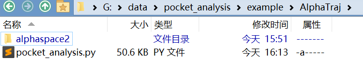
# User Guide

## Trajectory Preprocessing

Before analyzing trajectories with AlphaTraj, some simple preprocessing steps need to be applied to the trajectories.

1. **Removal of Solvent Molecules and Ions:**
   - Remove solvent molecules and ions, retaining only the protein and ligand (if present).

2. **Generation of Topology Files:**
   - Generate topology files suitable for the new trajectory.

Taking amber as an example, the demonstration uses cpptraj:
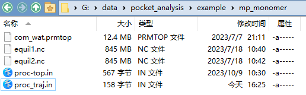

Here is an example we have prepared, using the main protease protein monomer. The files include com_wat.prmtop, which is the topology file for the complex (including water), and equil1.nc, equil2.nc, which are trajectory files, each representing 100 ns (1000 frames).

1. **Generate Topology File Without Solvent and Counter Ions:**

```shell
cpptraj -i proc-top.in
```

The script file (`proc-top.in`) contains:

```shell
# Load top file
parm com_wat.prmtop
# Strip
parmstrip :Na+,Cl-,WAT
# Write top
parmwrite out com_wat_strip.prmtop
run
quit
```

2. **Generate Trajectory File Without Solvent and Counter Ions:**

```shell
cpptraj -i proc-traj.in
```

The script file (`proc-traj.in`) contains:

```shell
# Load top file
parm com_wat.prmtop
# Load traj file
trajin equil1.nc
trajin equil2.nc
# Strip
strip :Na+,Cl-
strip :WAT
autoimage
# Write traj
trajout traj.nc cdf 
run
quit
```

1. After processing, the files in the folder look as follows:
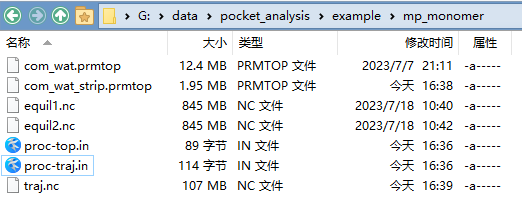
## Using AlphaTraj

AlphaTraj is a command-line program. Its usage syntax is:

```shell
python path_to_alphaTraj_dir/pocket_analysis.py [params]
```

### Parameter Overview

#### `-h`, `--help`:

Display help information.

#### `-v`, `--version`:

Display the software version.

#### `--top`:

Specify the location of the topology file.

#### `--traj`:

Specify the location of trajectory files. Paths for multiple trajectories should be separated by commas (","). Note that there should be no spaces between paths.

#### `--rec_mask`:

Specify the residue numbers of the receptor protein. If `rec_mask` and `lig_mask` are not specified, all molecules are considered proteins for analysis. If `rec_mask` is not specified but `lig_mask` is, the system will automatically calculate the residue numbers for `rec_mask`.

Format: `--rec_mask res_id_start,res_id_stop,res_id_start,res_id_stop...` (Note: `res_id_start` is inclusive, while `res_id_stop` is exclusive)

Example: If you want to specify residues 30-50, 60, and 80-101, it should be written as: `--rec_mask 30,51,60,61,80,102`

<span style="color: #ff6464">**Note: Please pay careful attention to the writing of this parameter. The residues of this parameter must appear in pairs, even for a single residue, a pair of residue numbers must be specified. The residue pair is a semi inclusion interval, where the starting residue is included and the ending residue is not included**</span>

#### `--lig_mask`:

Specify the residue numbers of the ligand. Format is the same as `rec_mask`. When a ligand is specified, alpha spheres too far from the ligand will be automatically removed.

#### `--box`:

By default, the program analyzes the entire surface of the protein, which may be time-consuming and require more memory. If you are only interested in a specific region of the protein, you can specify this parameter to limit the search range, greatly speeding up the analysis. If one box does not fit the shape of the pocket well, you can specify multiple boxes. The program will consider the range covered by all specified boxes.

Note 1: If `lig_mask` is specified, alpha spheres too far from the ligand will be automatically filtered out, so this parameter is not required.

Note 2: Each box needs a `--box` parameter; multiple boxes cannot be specified within one parameter.

Format: `--box atom1_id,atom2_id length(X-axis direction),width(Y-axis direction),height(Z-axis direction)` This parameter consists of two parts: the first part specifies the center of the box, with the center being the geometric center of the specified atoms. Atom IDs are separated by commas (","). The second part specifies the size of the box.

Example: `--box 372 18,10,22 458,963 14,12,20`

#### `--lig_cutoff`:

This parameter is also a distance cutoff value. When there is a ligand in the system, alpha spheres whose distance from the ligand exceeds this cutoff value will be deleted. The default value is 3.0 Ã….

#### `--dist_cutoff`:

Distance cutoff value during clustering of sub-pockets using hierarchical clustering to form flat clusters.

<span style="color: #ff0000;">**Note: This parameter is crucial; adjusting it will directly affect the clustering results of the pockets. The default value has been tested to be suitable, and in most cases, there is no need to change this parameter.**</span>

#### `--frame_start`:

Starting frame for trajectory analysis. This frame is included. Default is 1.

#### `--frame_stop`:

Ending frame for trajectory analysis. This frame is not included. Default is the last frame of the trajectory.

#### `--frame_offset`:

Step size for trajectory analysis. Default is 1.

#### `--out`:

Path to the folder for output results. If this folder does not exist, it will be automatically created. It is recommended to use an empty folder to store results to avoid confusion.

#### `--out_summary`:[true,false]

Whether to output information for all sub-pockets. Default is true; this option can only be set to true or false.

#### `--out_best`:[true,false]

Whether to output the best conformations. Default is true.

#### `--out_pock_info`:[true,false]

Whether to output raw information about pockets. Default is false. Default output format is npy.

#### `--out_group`:[true,false]

Whether to output group-related analysis results

#### `--out_main_best`:[true,false]

Whether to output the best conformations of the main group. Default is false.

#### `--out_coex`:[true,false]

Whether to output the coexistence matrix of sub-pockets. Default is false.

#### `--out_corr`:[true,false]

Whether to output the correlation matrix of sub-pockets. Default is false.

#### `--out_mtp`:[true,false]

Whether to output the migration rate matrix of the main group. Default is false.

#### `--is_use_score`:

Whether to use pocket scores when calculating the best conformation. Default is true. If false, the overall volume of the pocket will be used as the criterion for the best conformation.

#### `--percentile`:

Value of the parameter n for the fluctuation function. Range is 0-100; default is 80.

#### `--score_cutoff`:

Pockets with scores below this value will be ignored when calculating pocket scores.

#### `--best_num`:

Number of best conformations to output. Default is the top ten conformations.

#### `--main_num`:

Number of best conformations for the main group to output. Default is 1.

#### `--pock_info_ftype`:[txt,npy]

File type of the output pocket information file. Default is npy.

#### `--coex_sort_by`:[id,rank]

Sort order of rows and columns in the coexistence matrix output. id=sorted by pocket ID from small to large; rank=sorted by pocket ranking from small to large.

#### `--corr_sort_by`:[id,rank]

Sort order of rows and columns in the correlation matrix output. id=sorted by pocket ID from small to large; rank=sorted by pocket ranking from small to large.

#### `--config`:

Specify the location of the config file. When this parameter is specified, all other parameters in the command line will be ignored. The program will only use the parameters in the control file.

#### `--pickle`:

Serialize and save the analyzed results at the specified address. If this parameter is not specified, the results will not be saved.

#### `--unpickle`:

Restore data from the saved serialized file. If this parameter is specified, the parameters specified in the file will be read directly, and the parameters specified in the command line will be ignored.

### Control File Introduction

If there are too many parameters to specify, running through the command line can be cumbersome and prone to errors. In such cases, the control file mode can be used. The parameters in this mode are almost identical to the command line mode (with very few differences). This section introduces the writing conventions and parameter information for control files. The syntax differs slightly from the command line, as shown in the example file.

Firstly, let's introduce several parameters unique to the control file mode:

#### Tabs:

Names enclosed in \[\] are tab names. The \[GENERAL\] tab is used to set global parameters. The \[MODEL\*\] tab is used to set model parameters, where \* is a number (starting from 0, in sequential order). If mode=single, only \[MODEL0\] needs to be specified. If mode=multi, additional tabs can be specified like \[MODEL1\], \[MODEL2\], and so on.

The [GENERAL] tab includes mode and align_ Mask, dist_ Cutoff, is_ Use_ Score, percentage, score_ Cut off these parameters, and the other parameters are in the \ [MODE \ * \] tab.

<span style="color: #ff6464">**Tabs cannot be omitted, otherwise parameters cannot be read correctly. A control file must include the \ [GENERAL \] and \ [MODEL0 \] tabs, otherwise an error will also be reported.**</span>

#### `mode`:

Located under the \[GENERAL\] tab. This parameter controls the program's execution mode. In the single mode, a single protein is processed. In the multi mode, multiple proteins are processed simultaneously, and protein pocket IDs are unified. This mode is mainly used for pocket comparison.

#### `pock_pairs`:

Located under the \[GENERAL\] tab. This parameter is used to specify the output file for sub-pocket matching results

#### `match_score_cutoff`:

Subpockets scoring less than this cutoff value will be ignored for the duration of the pocket matching process. The default value is 0.0.

#### `match_dist_cutoff`:

The cutoff value for the clustering distance during pocket matching, default is 2.0.In general, it is sufficient to keep this parameter as default.

#### `align_mask`:

Located under every \[MODE#\] tab. This parameter is only required and must be specified in multi mode. It specifies the residue sequence for overlaying multiple models. Its format is the same as rec_mask. **Each model must be specified.**

#### Example confi.ini file:

The parameter names and input format in the file are the same as the command line parameters. # after the hash sign is a comment.
```shell
[GENERAL]
# The mode parameter controls the execution mode of the program. 
# There are two options: single and multi. When mode=single, 
# only a single model is processed. When mode=multi, execute the model comparison task
mode=single

# Distance cutoff value when clustering subpockets. The default value is 4.0
#dist_cutoff=4.0

# Whether to use pocket scoring function. If it is not, the pocket volume 
# will be used to rate the pocket. The default value is True
#is_use_score=True

# Characterize the value of hyperparameter n in the sub pocket fluctuation amplitude function. 
# An integer with values ranging from 0 to 100, defaulting to 80
#percentile=80

# Score below score_cutoff sub pockets will not be included in the pocket scoring calculation. The default is 10.0.
#score_cutoff=10.0

#When mode=multi, use this parameter to specify the output file path for pocket matching results.
#pock_pairs=

[MODEL0]
# Path to your topology file
top= ./com_wat_strip.prmtop

# specifies the path to the tracking file. Multiple paths separated by ','
traj= ./traj.nc

# specifies your receptor protein or ligand residue index. 
# If neither rec_mask nor lig_mask are specified, all atoms are considered as proteins. 
# If rec_mask is not specified but lig_mask is specified, then rec_mask = total_atom - lig_mask.
# (Note: Parameters must appear in pairs.) 
# Format: --rec_mask resn1,resn2,resn3,resn4... 
# Example: If you want to specify residues 1-50, 60 and 70-89 as your receptor protein: 
# "-rec_mask 1,51,60,61,70,90"
#rec_mask=
#lig_mask=


# If you are only interested in a certain region of the protein, you can specify 
# one or more location boxes that wrap around that region. 
# The analysis will be focused within the location boxes, which allows the program output 
# to filter out data you are not interested in.
# At the same time, this can speed up the running of the program and reduce the memory requirements.
# NOTE: To accommodate continuous changes in protein conformation, the box centers are set to 
# the coordinates of a single atom or to the geometric centers of several atoms, 
# which allows the box coordinates to be synchronized with the conformational changes of the protein.
# Format: --box atom1_id,atom2_id length(X-axis direction),width(Y-axis direction),height(Z-axis direction)
# Example: --box 372 18,10,22 458,963 14,12,20
box= 2126,4357 17,26,30

# Specify the starting, ending, and interval of the processed frames
frame_start=500
frame_stop=1000
#frame_offset=

# The folder where the analysis results are saved
out= ./

# Serialized data storage location, not specifying will not save the original data. 
# Suggest saving, you can directly read it later for other analyses, which can greatly save time.
pickle=./raw.dat
#unpickle=

# Control the content of the output
out_summary=true
out_best=true
out_pock_info=true
out_main_best=true
out_coex=true
out_corr=true
out_mtp=true
out_group=true

# Other
# Maximum number of best conformation retention
#best_num=
# Maximum number of best main group conformation retention.
#main_num=

# The file format for pocket information
pock_info_ftype=txt
# In what order are the rows and columns of the coex matrix arranged
coex_sort_by='rank'
# In what order are the rows and columns of the corr matrix arranged
corr_sort_by='rank'
```

### Running AlphaTraj (Demonstration)

#### Analyzing with AlphaTraj
Now that we understand the parameters, let's use AlphaTraj. Since it's a main protease without a bound receptor, we need to specify the pocket location first. We are interested in the region where the dimer interface of the main protease protein contacts. We want to see if it's suitable for designing inhibitors as alternative

 pockets. After examining the conformations, we have chosen the center and size of the box, detailed below.

| RESSEQ | NAME | SERIAL | X   | Y   | Z   |
| --- | --- | --- | --- | --- | --- |
| 136 | LYS CA | 2126 | 33.24 | 57.57 | 53.52 |
| 285 | LEU CA | 4357 | 29.06 | 69.0 | 41.19 |
|     | CENTER |     | 31.15 | 63.3 | 47.1 |
|     | BOX SIZE |     | 17  | 26  | 30  |

The diagram below illustrates the box position and size.

#### Command Line Execution

```shell
python G:\data\pocket_analysis\example\AlphaTraj\pocket_analysis.py --top ./com_wat_strip.prmtop --traj ./traj.nc --box 2126,4357 17,26,30 --frame_start 500 --frame_stop 1000 --out ./ --out_pock_info true --out_main_best true --out_coex true --out_corr true --out_mtp true --out_group true
```

#### Control File Execution

```shell
python G:\data\pocket_analysis\example\AlphaTraj\pocket_analysis.py --config ./config.ini
```

A sample control file looks like this:
```shell
[GENERAL]
mode=single
is_score=True

[MODEL0]
unpickle=./raw.dat

align_mask=1,307

out= ./align_model1

out_summary=true
out_best=true
out_pock_info=true
out_main_best=true
out_coex=true
out_corr=true
out_mtp=true
out_group=true

pock_info_ftype=txt
coex_sort_by='rank'
corr_sort_by='rank'
```

#### Execution Display

During runtime, the interface looks like the image below. You can intuitively see the progress, runtime, and remaining time.
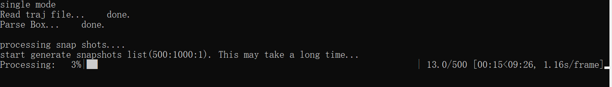  
At the normal end of the program, the output appears as shown below.
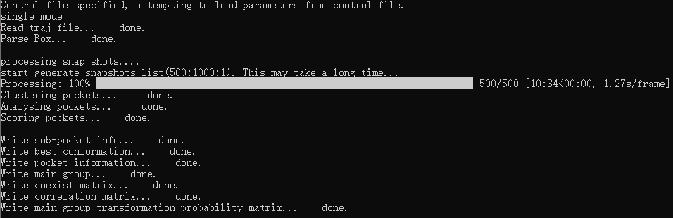
After the program runs, the folder content looks like this.
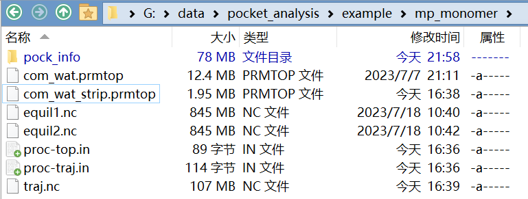  
All results are stored in the pock_info folder.

#### Comparing Multiple Systems with AlphaTraj
When using a control file, you can specify mode as multi to compare pockets of multiple systems, align pocket conformations, and perform comprehensive analyses. For example, we want to compare the pockets of the wild-type (model0) and mutant-type (model1) of the main protease. The results of the wild-type (model0) have already been analyzed and the raw data saved. We can directly read it. The control file is as follows:
```shell
[GENERAL]
mode=multi
pock_pairs=./pp.dat

[MODEL0]
top= ./com_wat_strip.prmtop
traj= ./traj.nc

#rec_mask=
#lig_mask=
box= 2126,4357 17,26,30

frame_start=500
frame_stop=1000
#frame_offset=

out= ./

out_summary=true
out_best=true
out_pock_info=true
out_main_best=true
out_coex=true
out_corr=true
out_mtp=true
out_group=true

pock_info_ftype=txt
coex_sort_by='rank'
corr_sort_by='rank'

[MODEL1]
unpickle=./raw.dat
align_mask=307,613
out=./comp/model0
out_best=true
out_main_best=true
```

*Note: Image links (image_link1, image_link2, image_link3) should be replaced with actual image URLs for a proper display.*
# Output File Explanation

The pock_info folder contains the following files:  
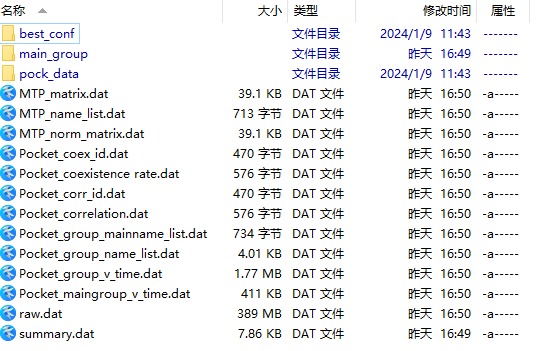
Let's explore them one by one.

### best_conf Folder

This folder stores files related to the best-conforming structures found.  
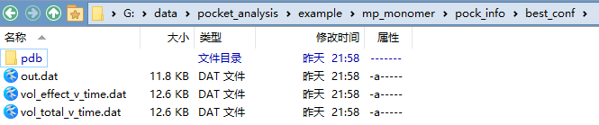

#### out.dat

This file contains information about the best-conforming structures. Each item's explanation is annotated in the image below.


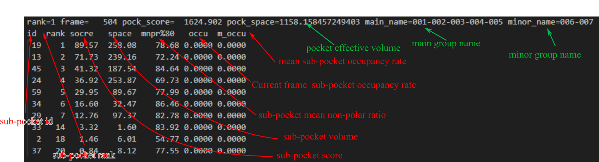


#### pdb Folder:

It stores complex structures and information about alpha pockets for drawing purposes.  
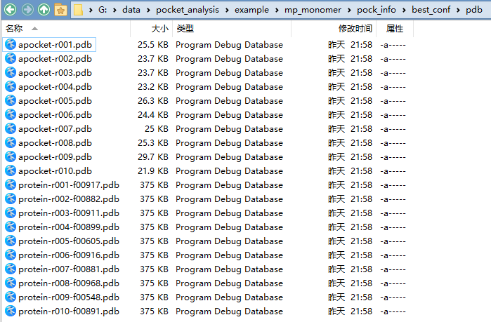  
The apocket file is for the alpha pocket. The suffix r-\[number\] indicates the ranking.  
The protein files are exported model conformations. The suffix r-\[number\] indicates the ranking, and f\[number\] indicates the frame.  
The annotation for the apocket file is shown below:


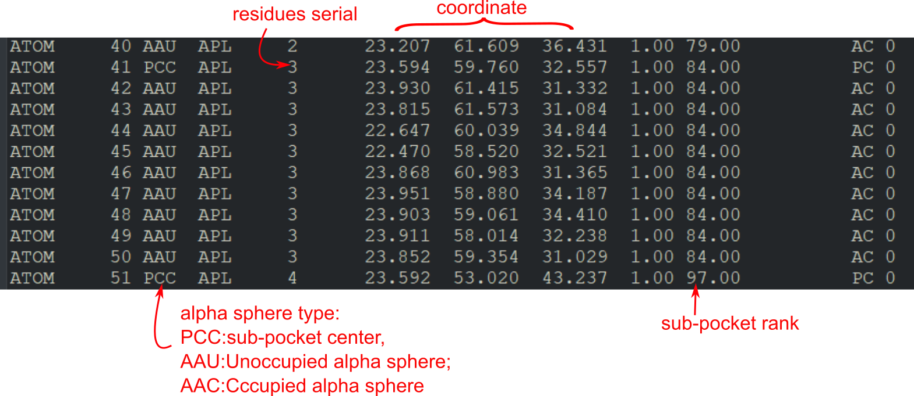


apocket files can be directly read by PyMOL. During drawing, use the sub-pocket ID to find the desired pocket, map it to residue serial, then find that residue in PyMOL, adjusting it as needed.

#### vol_xxxx_v_time.dat

vol_effect_v_time.dat: Changes in effective pocket volume over time  
vol_total_v_time.dat: Changes in pocket volume over time

### main_group Folder

The numeric string after "main" is the main group name, and s\[number\] is the pocket score.  
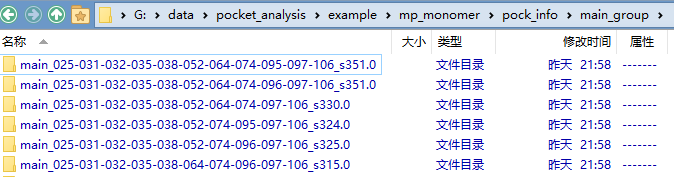  
The file organization in each folder is the same as the best_conf folder.

### pock_data Folder

This folder stores many original pocket data for further processing. The default format is npy.  
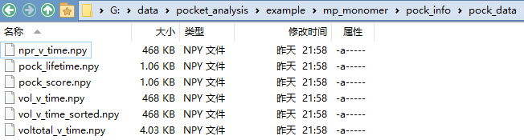

#### npr_v_time.npy:
Non-polarization rate of sub-pockets over time. Matrix $pock\_num*frame\_num$
#### pock_lifetime.npy:
Pocket lifetime. Sequence, length is the number of sub-pockets, each item is in frames.
#### pock_score.npy:
Pocket scores. Sequence, length is the number of sub-pockets.
#### vol_v_time.npy:
Sub-pocket volume over time. Matrix $pock\_num*frame\_num$
#### vol_v_time_sorted.npy:
Sorted sub-pocket volumes. Matrix $pock\_num*frame\_num$, arranged from smallest to largest.
#### voltotal_v_time.npy:
Pocket volume over time.

### MTP_matrix.dat & MTP_name_list.dat:
MTP_matrix.dat: Main sub-pocket group transformation probability matrix  
MTP_name_list.dat: This file stores the names corresponding to each column of the matrix. The first row corresponds to the first row and column of the matrix.

### Pocket_coexistence rate.dat & Pocket_correlation.dat & Pocket_sync_corr_id.dat
Pocket_coexistence rate.dat: Sub-pocket coexistence matrix  
Pocket_correlation.dat: Sub-pocket correlation matrix  
Pocket_sync_corr_id.dat: Corresponding pocket IDs of rows and columns in the coexistence and correlation matrices. The first row corresponds to the first row and column of both matrices.

### Pocket_group_v_time.dat & Pocket_group_name_list.dat
Pocket_group_v_time.dat: Sub-pocket group changes over time (Matrix: Rows - Frames, Columns - Group Types)  
Pocket_group_name_list.dat: Names of sub-pocket groups for each column in the graph of changes over time. Combinations of main group name and sub-group name.

### summary.dat
Information about all sub-pockets.

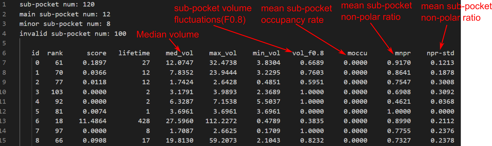

### raw.dat
Raw data file generated when specifying the pickle parameter. Can be loaded using the unpickle parameter.

### pock_pairs.dat
Each row is the pocket rank matched by a model, -1 indicates no matched pocket.  
Note: Matching only counts non-invalid sub-pockets. So, the absence of a matched pocket does not imply non-existence; it might be that the pocket became an invalid sub-pocket.


# Using AlphaTraj as a Python Library

AlphaTraj can be utilized as a Python library, significantly enhancing its convenience and extensibility. The following demonstrates the basic usage:

```python
import sys

# Specify AlphaTraj directory path
AlphaTraj_path = 'G:/data/pocket_analysis/project/'
sys.path.append(AlphaTraj_path)  # Add to Python's library search path

import pocket_analysis as PA  # Import Package
from pocket_analysis import *  # Import class and method

# Prepare parameters.
# All parameters are given in dictionary form. DICT[str, str]
# The key is the parameter name, consistent with the command line parameter name.
# The value is a parameter value, and all parameter values must be of type str, with the same format
# as command-line parameters.

param = {'top': './com_wat_strip.prmtop',
         'traj': './traj.nc',
         'box': '5354,7272 20,20,20',
         'rec_mask': '307,613',
         'pickle': './raw.dat'}

# Import from raw data
param = {'unpickle': 'G:/data/sars-cov-2/main_protease/mp_mut_dimer/analysis/pock/pock_info_p0c1_24009/pickle_pa.dat'}

# Set the GENERAL parameters (corresponding to the parameters in the GENERAL tag in config.ini)
gparam = {}
gparam = PA.ParserGeneral(gparam)

# Get PocketAnalysis class
pa1 = PA.GetPA(param, gparam)

# Process
pa1.Analysis(500, -1, 1)

p2arg = {'unpickle': './raw.dat'}
pa2 = PA.GetPA(p2arg, gparam)

mg = PA.ModelGroup()
mg.AddPA(pa1)
mg.AddPA(pa2)

align_rec = '1,307'
align_mask = [np.array(PA.ParserMask(pa1.rec, align_rec, 'bb')),
              np.array(PA.ParserMask(pa2.rec, align_rec, 'bb'))]

mg.AlignModel(align_mask)  # Align model
model_pnum, model_pid, clusterid = mg.PocketMatch(dist_cutoff=2.5)  # Get pocket match info

# Save protein
mg.pa_list[0].rec[10].save('./test_p1_f10.pdb')
mg.pa_list[1].rec[10].save('./test_p2_f10.pdb')

# Save pocket
mg.pa_list[0].WritePockets(10, './test_p1_f10_pa.pdb')
mg.pa_list[1].WritePockets(10, './test_p2_f10_pa.pdb')

# Using encapsulated methods to output results
oparam={'out':'./',
        'out_summary':'true',
        'out_best':'true',
        'out_pock_info':'true',
        'out_main_best':'true',
        'out_coex':'true',
        'out_corr':'true',
        'out_mtp':'true',
        'out_group':'true'}

PA.WriteFiles(pa1,oparam)
```

# Drawing Demo

## Protein surface diagram
This section illustrates how to utilize PyMOL to generate surface diagram of protein pockets resembling the style depicted in figures from our published [articles](https://pubs.acs.org/doi/10.1021/acs.jctc.4c00476).

Figure 4 in the article:
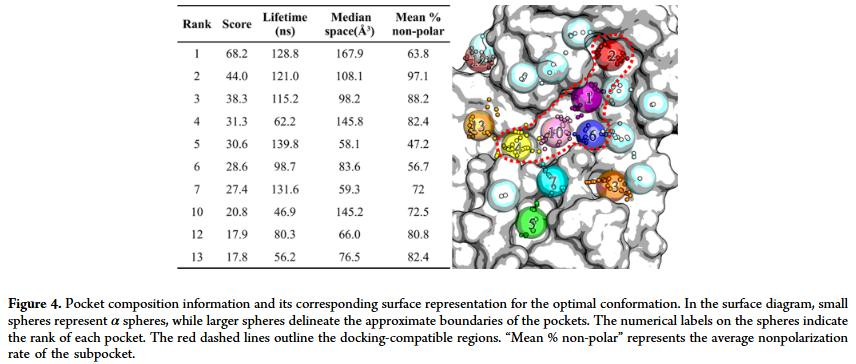

These are the files we will utilize. You can download them and follow the tutorial step by step: [out.dat](./_resources/file/out.dat), [apocket-r001.pdb](./_resources/file/apocket-r001.pdb), [protein-r001-f01705.pdb](./_resources/file/protein-r001-f01705.pdb).  

Let's get started.:smile:

### STEP 1 Import the file
1. Open PyMOL.
2. Import apocket-r001.pdb and protein-r001-f01705.pdb.
3. Rename "apocket-r001" as "ap" and "protein-r001-f01705" as "rec". (<font color=#3498DB>This step is for convenience in subsequent operations; you can also use the original names or any names you prefer.</font>)
4. Adjust the view to your desired perspective.
   


### STEP 2 Draw
1. Display the protein "surface" and set the protein color to "gray90"
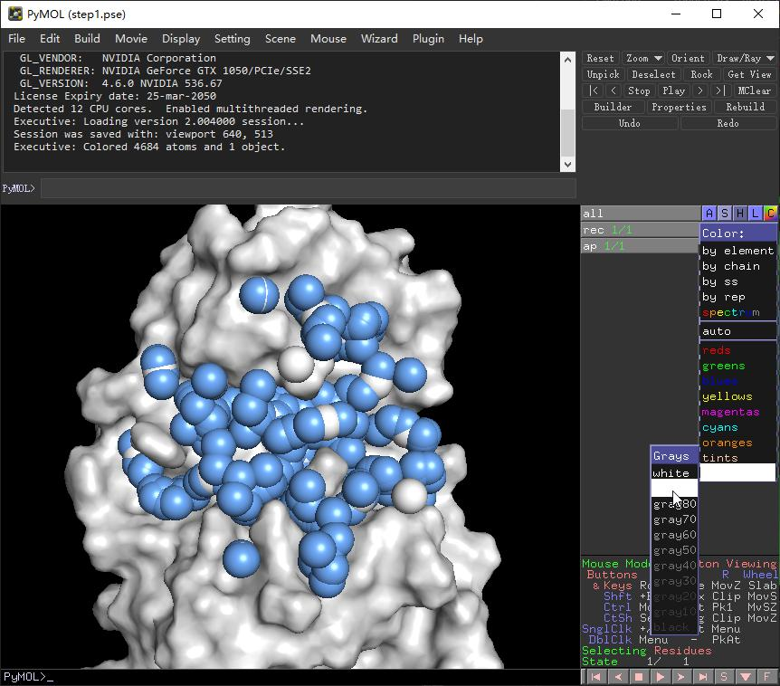
2. Resize spheres scale to 0.15. (Code: `set sphere_scale, 0.15`)
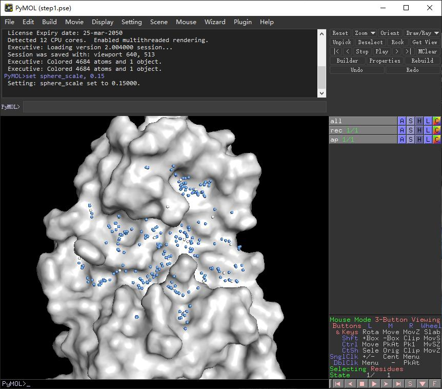
3. Open the file apocket-r001.pdb using a text editor such as Sublime or VS Code. The third-to-last column in the file represents pocket rankings. (The original PDB file uses this column to store Temperature factors. Since the format of this column is floating-point numbers with .00 appended to each number, please disregard the decimal part of this column directly.)
4. Within apocket-r001.pdb, each sub-pocket corresponds to a residue. Taking the top-ranked pocket as an example, we first locate the column where the value is 1.00 in the third-to-last column. Then, we inspect the values in these columns corresponding to the fifth column, which represent residue numbers. In our system, the residue number for the top-ranked sub-pocket is 3. With the residue number, you can directly select the sub-pocket in PyMOL.

5. Back in PyMOL, now select residue 3 in "ap" and name this selection "sp1". (Code: `select sp1, resi 3 and ap`).
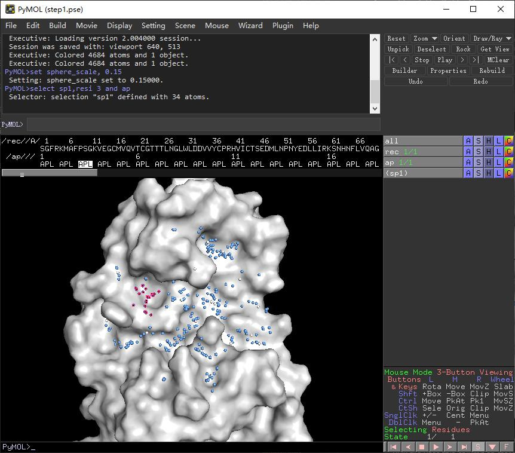
6. Repeat steps 4 and 5 to select all the sub-pockets you need. Here, we have selected all sub-pockets with scores exceeding 10 in out.dat.
7. Apply a palecyan hue to "ap" (this step establishes the color for unselected sub-pockets, though you may opt for a different color), and then color each selected sub-pocket according to your preference.
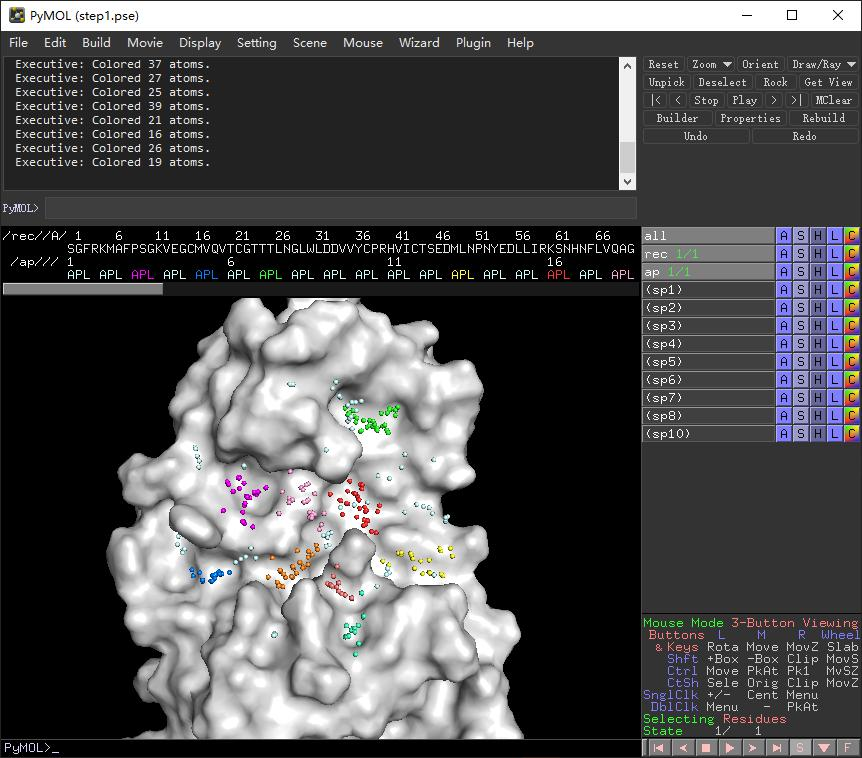
8. Select all "PCC" atoms from "ap" and save them as "ap-pcc"(Code: `select ap-pcc,name pcc and ap`). 
9. Set the sphere_scale of "ap-pcc" to 1.0.(Code: `set sphere_scale, 1.0, ap-pcc`)
10. Set the sphere_transparency of "ap-pcc" to 0.3.(Code: `set sphere_transparency, 0.3,ap-pcc`)
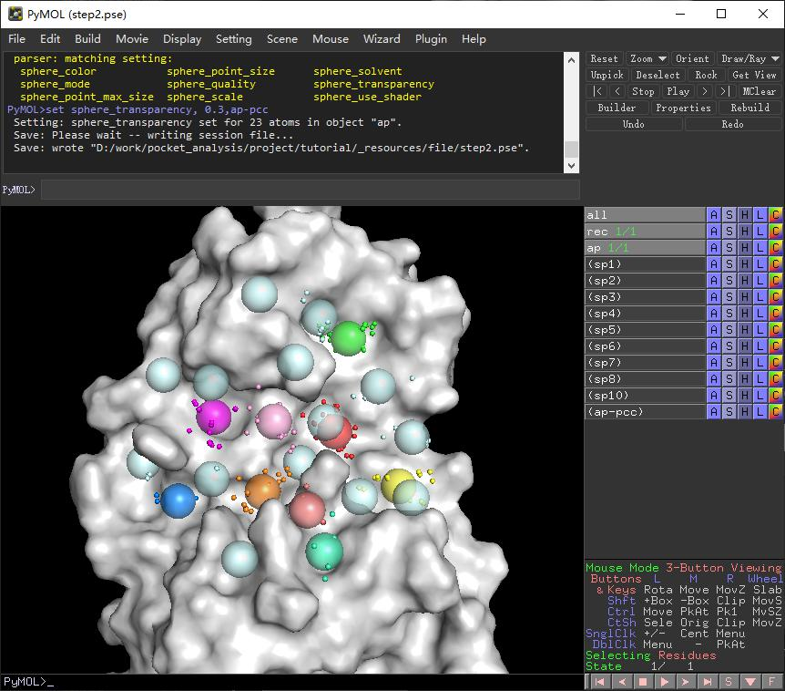

### STEP 3 Stylized
1. Before rendering, you can make some adjustments to enhance the outcome, such as improving the quality of the protein surface and changing the background color.
```python
set surface_quality, 2
set surface_color_smoothing_threshold, 0.5
bg_color white
set ray_shadow,0
```
2. Now, you can render finished images using the "ray" command, or you can customize styles using the "ray_trace_mode" option.  
ray_trace_mode=0

ray_trace_mode=3
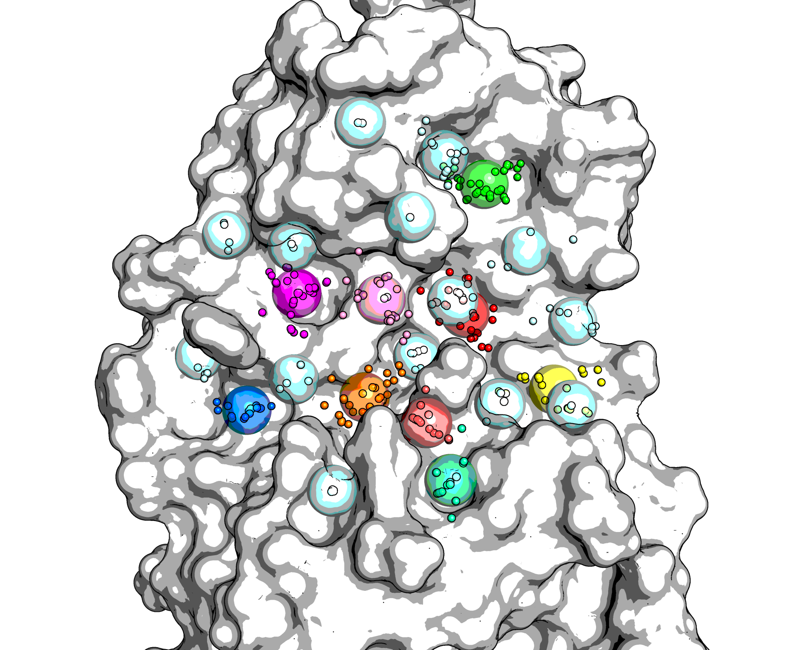

Lastly, the .pse files for each step in PyMOL can be accessed here for reference (
   [step1.pse](./_resources/file/step1.pse), 
   [step2.pse](./_resources/file/step2.pse), 
   [step3.pse](./_resources/file/step3.pse)).


## Temporal evolution plots of the groups

This chapter outlines the procedures for graphing the temporal progression of main group elements.
To generate this plot, two files are required: "[Pocket_maingroup_v_time.dat](./_resources/file/Pocket_maingroup_v_time.dat)" and "[Pocket_group_mainname_list.dat](./_resources/file/Pocket_group_mainname_list.dat)". You may download these files beforehand and follow the tutorial step-by-step.

Let's get started.:smile:

### Use Origin to draw
*Note: The demonstration is performed using OriginPro 2018. The interface may differ from the one you are using due to version discrepancies.*
1. import "Pocket_maingroup_v_time.dat"  
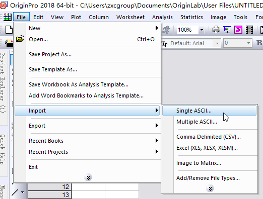  
After importing, the data appears as depicted in the following figure. Each column represents a main group, while each row corresponds to a frame. If a pocket is absent in a particular frame, the value is marked as -1; otherwise, it is a positive integer. Different main groups possess distinct values (i.e., different columns hold different values), enabling the points of different main groups to have varying heights during plotting, thereby facilitating their differentiation.
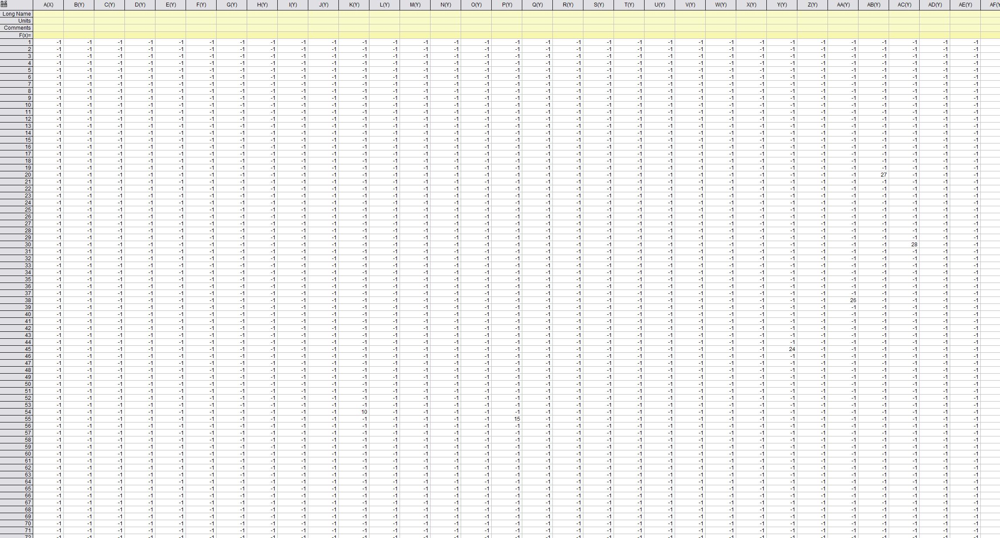  

2. Currently, only the data for the y-axis is available. We need to add a column of x-axis information.  
Insert a column at the very beginning.  
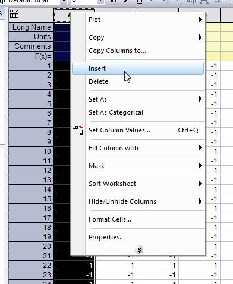  
Set this(first) column as the x-axis. The second column is for the y-axis.  
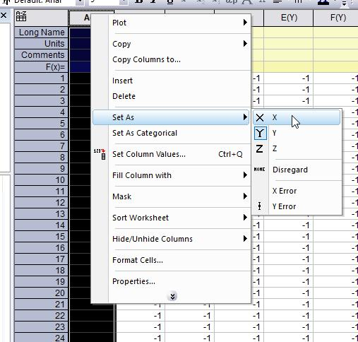  
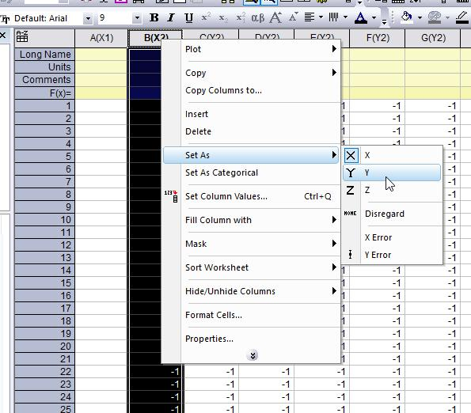  
Fill the first column with row numbers.  
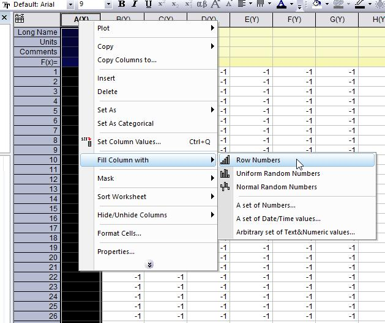  
After the above operations, the data table will eventually look like the following figure.  
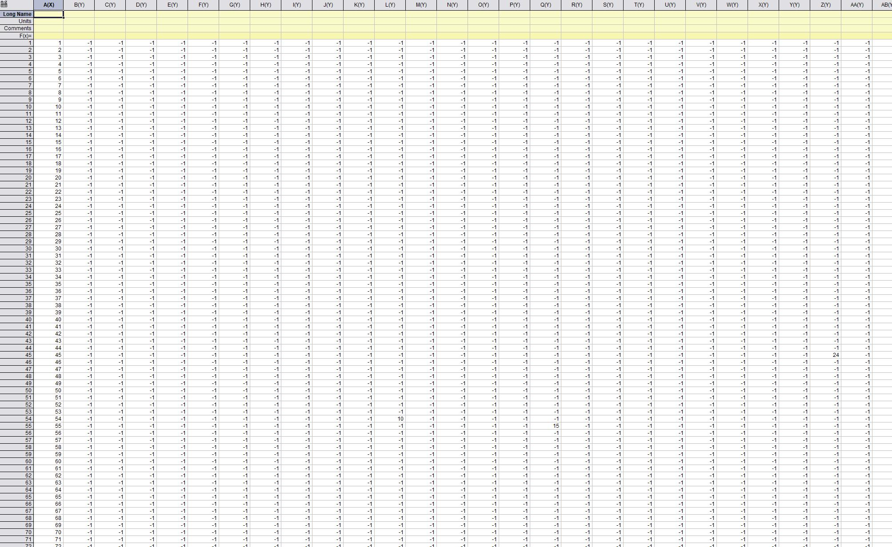  

3. Select all the data, then click on "plot" -> "Scatter" -> "Scatter" sequentially.
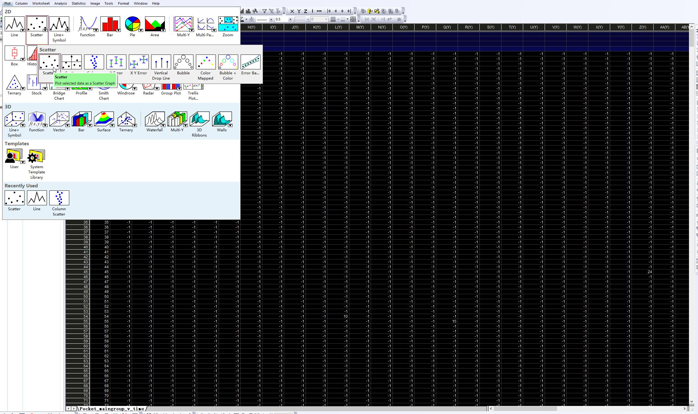  
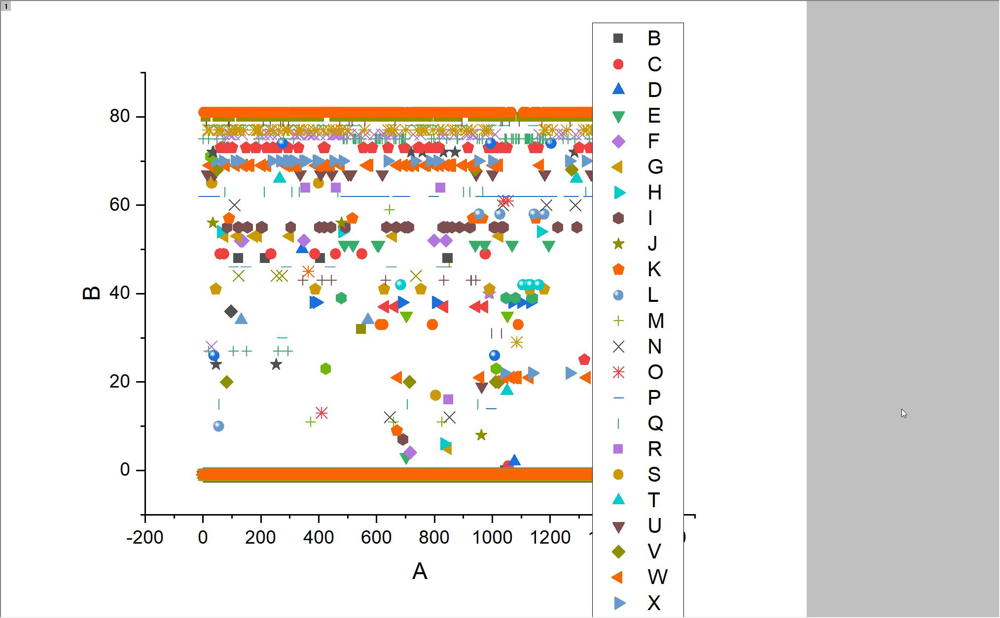

Next, refine the obtained scatter plot as follows:  
- Eliminate the legend.  
- Adjust the y-axis range to 61.5-81.5 (to hide rows with values of -1) and remove the y-axis title.
- Adjust the x-axis range to 0-1500 (our data spans 1500 frames). Under the "Tick Labels" tab, set "Divide by Factor" to 10 (to convert frames to ns) and set the x-axis title as "Time (ns)".  
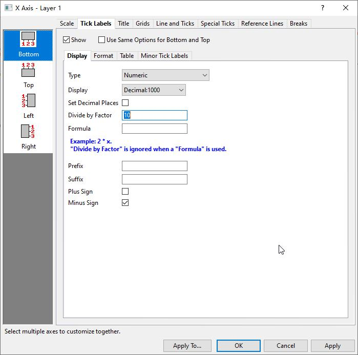
- In the "Symbol" tab under "Plot Properties," set the size to 2.  
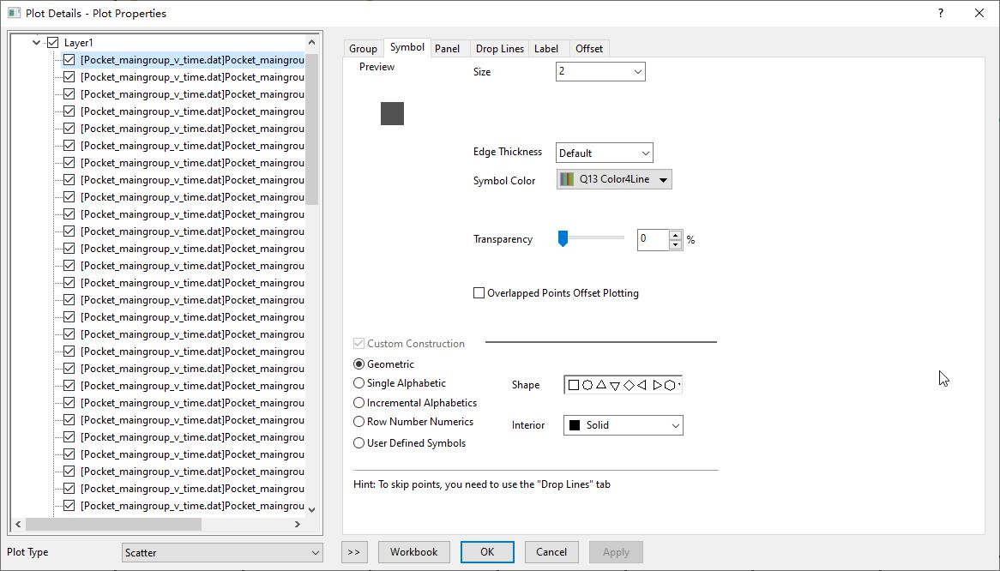
- In the "Group" tab under "Plot Properties," under "Symbol Type," set "Increment" to "None".  
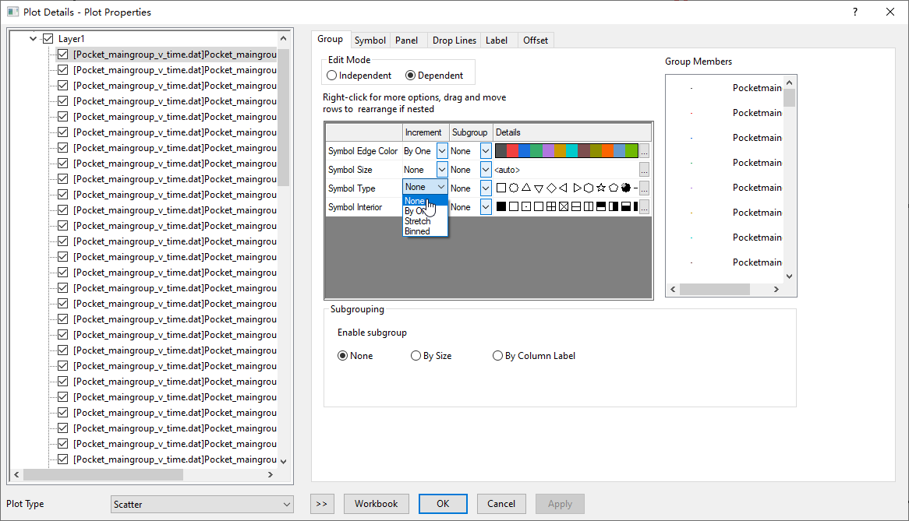
- Display the top and right axes.

**The adjusted scatter plot is shown below.**
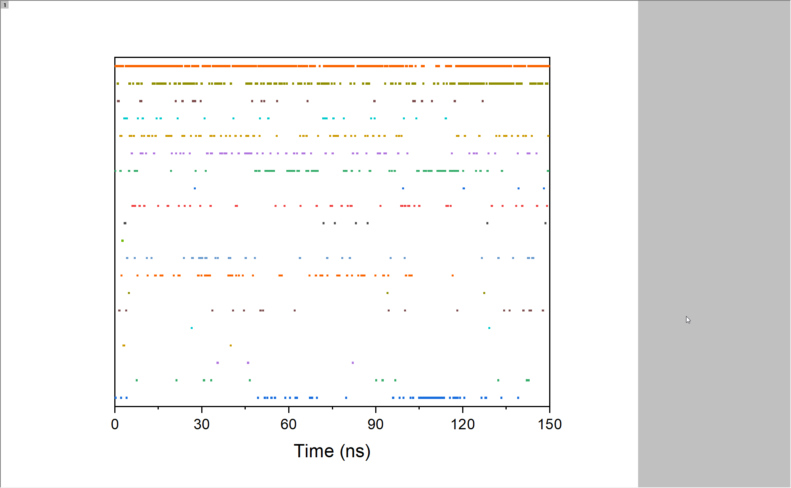

4. Finally, let's add labels to the y-axis. Since each row in the graph represents a main group, displaying the names of all main groups would clutter the graph and diminish its aesthetics. We only need to highlight the ones we require, typically those with a significant presence over time. This necessitates the use of the second file, "Pocket_group_mainname_list.dat", where the first column contains the main group names and the second column represents their survival time.  
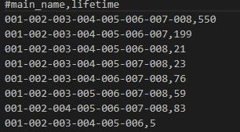  
The main group listed in the second row of this file corresponds to the top row in the scatter plot (the row with the highest y-value). It is also the main group in the last column of the "Pocket_maingroup_v_time.dat" file.  
**In other words, the main groups in "Pocket_group_mainname_list.dat" are arranged in reverse order, with the main groups at the beginning having higher pocket scores.**  
**Main groups with lower scores typically have shorter survival times. This is why we only select main groups with scores of 62 or above. (Adjust the y-axis range to 61.5-81.5)**  
Now, let's label it on the y-axis.
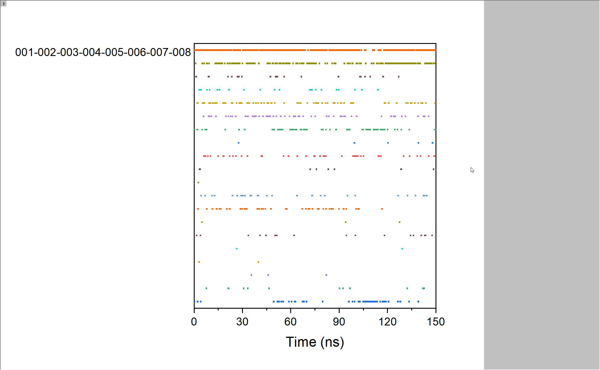  
As the names of the main groups are excessively long, I've repositioned the image on the canvas. (Alternatively, using abbreviations to represent the names can address the issue of length, thereby avoiding the need to adjust the image's placement on the canvas.)

The final illustration is displayed below. **However, please note that this is just a rough representation of the drawing process. Further optimization and adjustments are necessary to meet academic standards.**
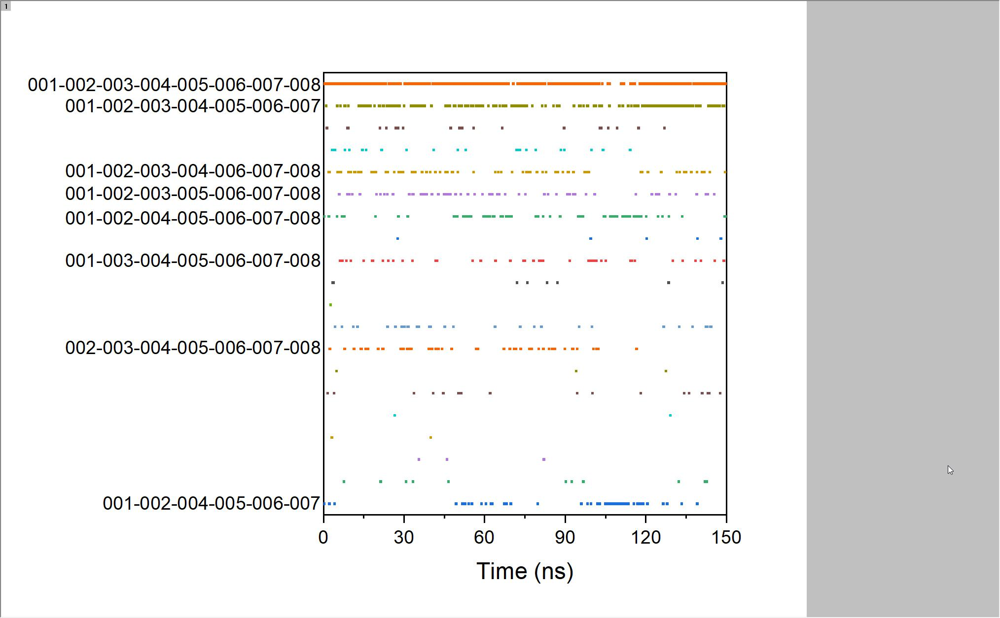

You can find the [origin.opju](./_resources/file/origin.opju) file here for your reference.
